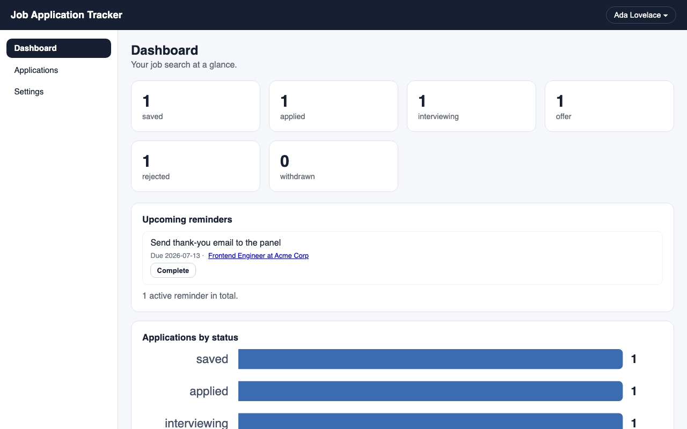
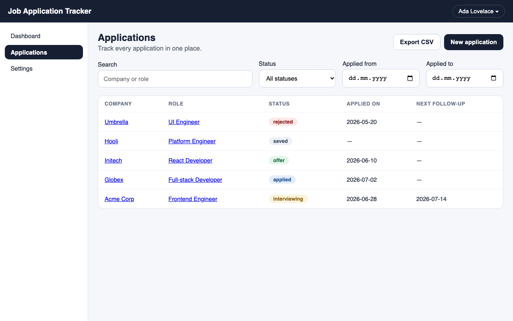
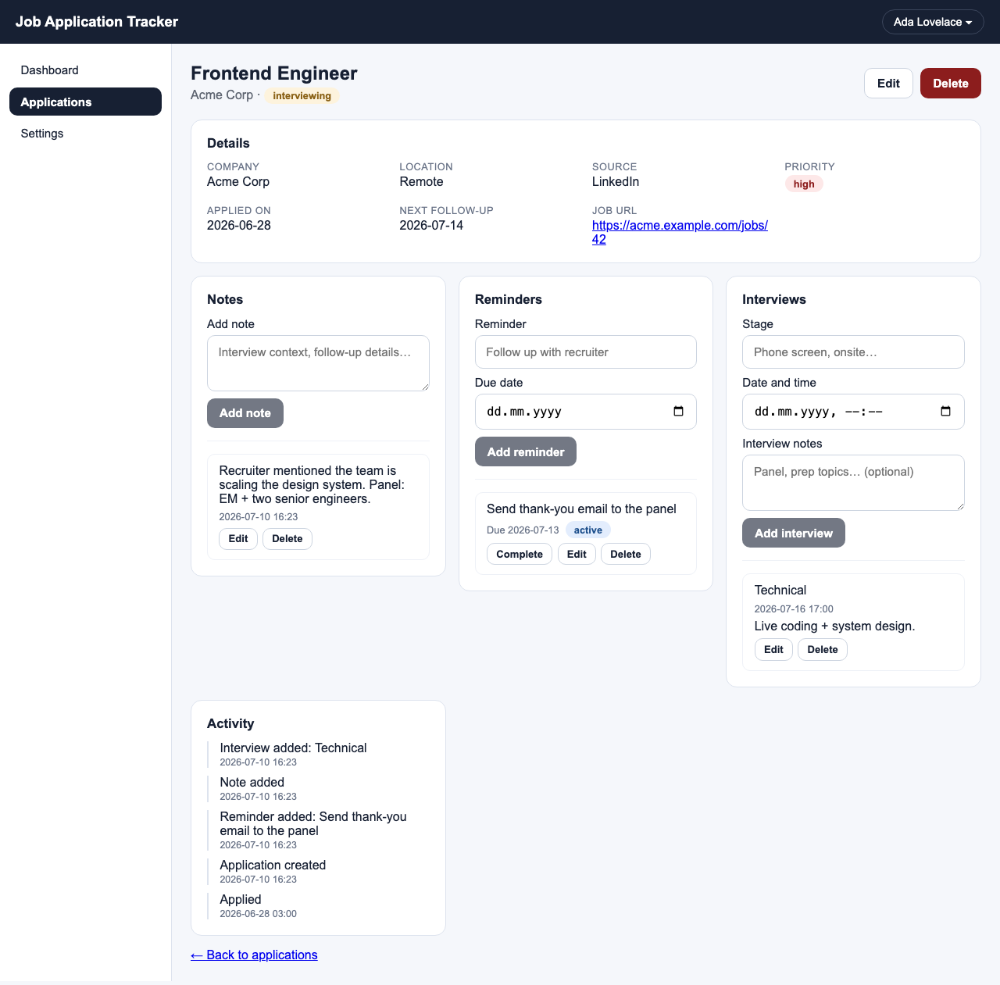

# Job Application Tracker

**A self-hostable workspace for running your job search: track every application, its notes, reminders, and interviews in one place.**

Job hunting quickly outgrows a spreadsheet — statuses drift, follow-ups slip, and interview context ends up scattered across emails. This tracker keeps the whole story of each application together, on your own machine and your own database. It's built for job seekers who want their data private and hackable, and for developers who want a clean full-stack TypeScript codebase to extend.

## Features

- 🔐 **Accounts & sessions** — cookie-based auth; every record is owned by (and only visible to) its user.
- 📋 **Applications CRUD** — company, role, status (saved → applied → interviewing → offer/rejected/withdrawn), priority, dates, job URL.
- 🔎 **Search, filters & sorting** — filter by status and applied-date range, search by company/role, sortable columns; all instant and client-side.
- 🗂️ **Detail workspace** — per-application notes, reminders (with overdue badges and complete/reopen), interviews (stage + date), and an activity timeline.
- 📊 **Dashboard** — status counts, a status-distribution chart, upcoming reminders you can complete in place, and recent applications.
- 📤 **CSV export** — one click downloads your applications (filter-aware, RFC 4180-safe, opens cleanly in Excel/Sheets).
- 📱 **Responsive UI** — sidebar on desktop, hamburger nav on mobile.
- ✅ **Tested end to end** — unit tests on both apps plus a Playwright suite that drives the real stack.

## Screenshots

| Dashboard | Applications |
| --- | --- |
|  |  |

<details>
<summary>Application detail workspace (notes, reminders, interviews, timeline)</summary>


</details>

## Tech stack

- **Frontend:** React 18, TypeScript, Vite, react-router — Vitest + Testing Library for tests.
- **Backend:** Node.js 22, Express, TypeScript (`tsx`) — `node:test` for tests.
- **Database:** PostgreSQL via Prisma ORM.
- **E2E:** Playwright. **Tooling:** ESLint (type-aware), npm workspaces, Docker Compose, GitHub Actions CI.

## Getting started

### Prerequisites

- **Node.js 22** (see `.nvmrc`; `npm install` refuses other versions — `engine-strict=true`). With [nvm](https://github.com/nvm-sh/nvm): `nvm install && nvm use`.
- **PostgreSQL** — easiest via **Docker** (`docker compose up -d db`), or any Postgres reachable from `DATABASE_URL`.

### Quick start

Run the setup script from the repo root. It selects Node 22 (via nvm, if installed), installs dependencies, creates `.env` files, starts Postgres (via Docker, if available), and applies migrations + seed data. Each step checks its own state, so it's safe to re-run:

```bash
./scripts/setup.sh
```

Then start the app:

```bash
npm run dev:server   # API on http://localhost:4000
npm run dev          # frontend on http://localhost:3000
```

Open http://localhost:3000, create an account, and start tracking.

<details>
<summary>Manual setup (without the script)</summary>

1. On Node 22, install dependencies from the repo root:
   ```bash
   npm install
   ```
2. Create local environment files:
   ```bash
   cp apps/client/.env.example apps/client/.env
   cp apps/server/.env.example apps/server/.env
   ```
3. Start Postgres and apply migrations + seed data:
   ```bash
   docker compose up -d db
   npm run db:migrate --workspace apps/server
   npm run db:seed --workspace apps/server
   ```
4. Start both apps (two terminals):
   ```bash
   npm run dev:server   # API on :4000
   npm run dev          # frontend on :3000
   ```
</details>

<details>
<summary>Running the whole stack with Docker</summary>

```bash
docker compose up --build
```

Builds the client and server images and starts Postgres; frontend on http://localhost:3000, API on http://localhost:4000. `VITE_API_URL`/`DATABASE_URL` are set in `docker-compose.yml`, so no `.env` files are needed. Note: the images bake the code in at build time — rebuild (`docker compose up -d --build client server`) after changing source.
</details>

### Environment variables

- **Frontend** (`apps/client/.env`): optional `VITE_API_URL` (absolute API URL; unset = relative `/api` paths proxied by Vite to `:4000`) and `VITE_PORT` (default 3000).
- **Backend** (`apps/server/.env`): `PORT` (default 4000) and `DATABASE_URL`.

## Usage notes

- **Dashboard** (`/dashboard`) — powered by `GET /api/dashboard/summary`: zero-filled status counts, incomplete reminders due within 7 days (completable in place), and the 10 newest applications.
- **Detail workspace** (`/applications/:id`) — notes, reminders, and interviews live under each application; the activity timeline is derived from their history.
- **CSV export** — the applications list's **Export CSV** button downloads `applications-YYYY-MM-DD.csv`, honoring the active status/date filters. Endpoint: `GET /api/applications/export?status=applied,interviewing&from=2026-01-01&to=2026-06-30`; the full column schema is documented in `apps/server/src/export.ts`. Only your own data is ever exported.
- **Auth** — cookie-based sessions (`POST /api/auth/{signup,login,logout}`, `GET /api/auth/me`). Unauthenticated requests to protected routes get `401` and the client redirects to `/login`. Dev cookies are `SameSite=Lax` (client and API share `localhost`); production uses `SameSite=None; Secure`.
- **Re-seeding** — `npm run db:seed --workspace apps/server` wipes and reloads sample data; the setup script seeds only once (delete `.setup-complete` to force it).

## Testing

```bash
npm test                            # client + server unit tests
npm test --workspace apps/client    # client only (no DB needed)
npm test --workspace apps/server    # server only (Postgres required)
npm run test:e2e                    # Playwright end-to-end suite
npm run test:e2e:ui                 # ... in interactive UI mode
npm run ci                          # lint → typecheck → tests → build (local CI)
```

- **Client unit tests** (`apps/client/test/`, Vitest + Testing Library) cover pages, hooks, and components in isolation.
- **Server tests** (`apps/server/test/`, `node:test`) hit the real database — start it with `docker compose up -d db`.
- **E2E** (`e2e/`, Playwright) drives the real stack through a headless browser: auth, navigation (incl. mobile), applications CRUD with ownership isolation, the detail workspace, the dashboard, and CSV downloads. One-time browser install: `npx playwright install chromium`. The config auto-starts dev servers if ports 3000/4000 are free — stop the docker `client`/`server` containers first so tests run your working tree.

## Roadmap

See [ROADMAP.md](ROADMAP.md) for the full picture. In short: the MVP (auth, applications CRUD, detail workspace, dashboard, CSV export) is **done**; next up are resume versions, richer analytics, and data import.

## Contributing

Contributions are welcome — code, tests, docs, and design alike. Start with [CONTRIBUTING.md](CONTRIBUTING.md) for the dev workflow and PR process, and check the [good first issues](docs/good-first-issues.md) for well-scoped starting points.

## License

[MIT](LICENSE) © Matin Manafov
